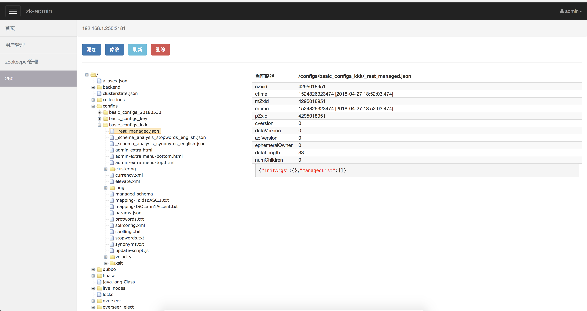
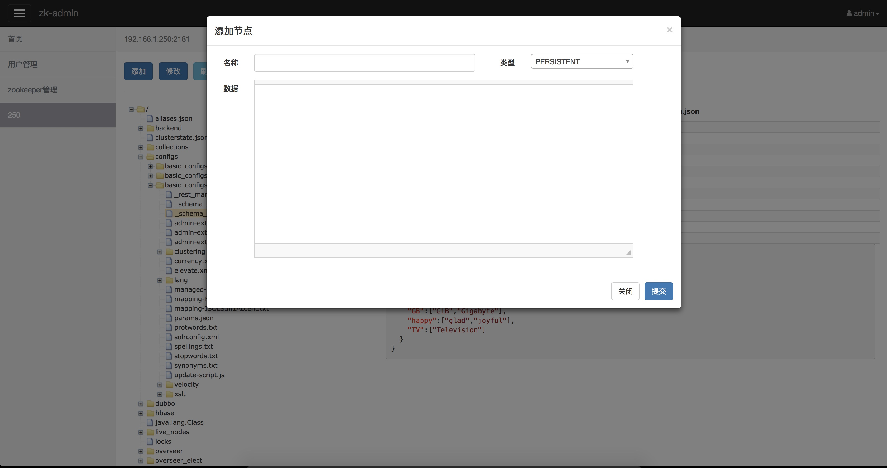

# zk-admin

一个使用Spring boot搭建的，简单的zookeeper管理后台。方便操作节点的增删改查

- 用户管理和zookeeper连接信息管理比较简陋，后面慢慢优化。节点相关操作功能是比较全的
- data.sql里面是数据初始SQL，初始化用户名admin 密码admin，并且启动前记得将SQL中的邮箱加上
- 如果遇到问题，麻烦帮忙提出来

树状显示

添加节点
